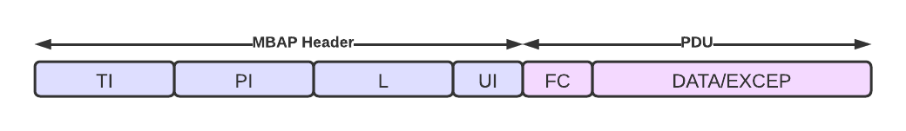

# Server Modbus TCP

## Description

Modbus TCP is a communication protocol intended for supervision and control of automation equipment. 

    

The messages used in the communication are ADU (Application Data Unit) and it is a byte array with the following structure:

- MBAP Header
    - TI (Transaction Identifier) - 2 Bytes
        
        transaction code, unique set by the client

    - PI (Protocol Identifier) 2 Bytes

        always 0

    - L (Length) - 2 bytes

        the number of bytes to its right (1 (UI) + 1 (FC) + n (DATA))

    - UI (Unit Identifier) - 1 byte

        used if the client is not connected to a TCP/IP network

- PDU (Protocol Data Unit)
    - Normal Response
        - FC (Function Code) - 1 byte

            0x01, 0x02, 0x03, 0x04, 0x05, 0x06,0x0F, 0x10
        - Data - n bytes

            values, offsets
    - Exception Response
        - FC (Function Code) - 1 byte

            0x01, 0x02, 0x03, 0x04, 0x05, 0x06,0x0F, 0x10 + 0x80
        - Exception Code - 1 byte

            0x01, 0x02, 0x03, 0x04, 0x05, 0x06

    

Memory:

    

Exceptions:
- Illegal Function (0x01)
- Illegal Data Adress (0x02)
- Illegal Data Value (0x03)
- Server Failure (0x04)
- Server Busy (0x06)

## Requirements
- Python 3.7+
- mysql for python (optional - pip install mysql-connector-python)
- MySQL (optional)
- IDE (optional - PyCharm/VsCode) 

## Implementation
The data can be stored in a database (MySQL) or in a JSON file, both are implemented (`config.py` - DB = True it used the database, False it uses the JSON file) but I haven't tested that much with the database.

I created a server socket that listens to the clients, if a client connects a theread is started with that client. The socket remains active as long as the client is still connected. For every request an ADU object  is created by splitting the request into chunks to match ADU's structure (if that makes sense :)).

How the functions works:
- Read Coil Status(0x01)

    It reads multiple coils (bits) 

    

- Read Discrete Inputs(0x02)

    It reads multiple discrete inputs (bits) 

    

- Read Holding Registers(0x03)

    It reads multiple holding registers

    

- Read Input Registers(0x04)

    It reads multiple input registers

    

- Force Single Coil(0x05)

    It writes a single coil (bit)

    

- Write Single Register(0x06)

    It writes a single holding register

    

- Force Multiple Coils(0x0F)

    It writes multiple coils (bits)

    

- Write Multiple Registers(0x10)

    It writes multiple holding registers 

    

## References
- application used to test the functionality: [simply modbus](https://www.simplymodbus.ca)
